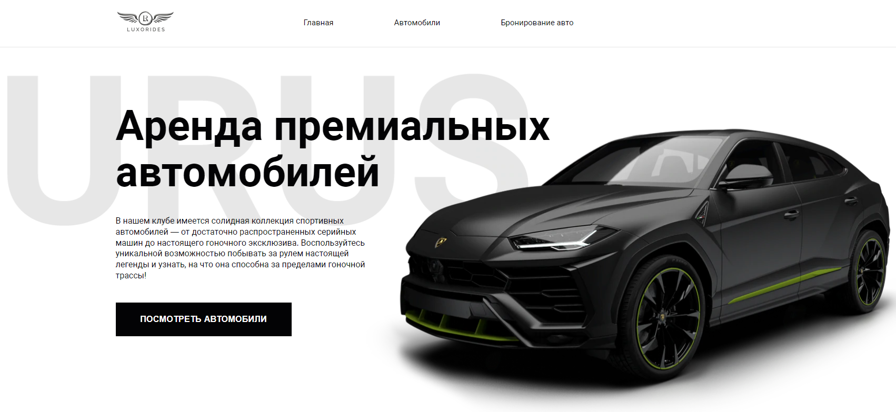

# Проект: Car App для аренды автомобилей. (Angular)

### [ Ссылка на проект ](https://rassellek.github.io/cars-hw/)

### Цель и задачи проекта:

Реализовано веб-приложение (сайт), содержащее страницу:

<ul>
<li>Главная страница со списком автомобилей (карточек), содержащих изображение, заголовок, описание и кнопку действия, реализующую механизм добавления в форму аренды.</li>
<li>Реализация взаимодействия с сервером для получения и отправки данных.</li>
</ul>

 

### Данный проект создавался на стеке:

 

### Используемые программы:

